---
## Front matter
title: "Отчёт по лабораторной работе №2"
subtitle: "Дисциплина: Архитектура компьютера"
author: "Воронов Александр Валерьевич"

## Generic otions
lang: ru-RU
toc-title: "Содержание"

## Bibliography
bibliography: bib/cite.bib
csl: pandoc/csl/gost-r-7-0-5-2008-numeric.csl

## Pdf output format
toc: true # Table of contents
toc-depth: 2
lof: true # List of figures
lot: true # List of tables
fontsize: 12pt
linestretch: 1.5
papersize: a4
documentclass: scrreprt
## I18n polyglossia
polyglossia-lang:
  name: russian
  options:
	- spelling=modern
	- babelshorthands=true
polyglossia-otherlangs:
  name: english
## I18n babel
babel-lang: russian
babel-otherlangs: english
## Fonts
mainfont: IBM Plex Serif
romanfont: IBM Plex Serif
sansfont: IBM Plex Sans
monofont: IBM Plex Mono
mathfont: STIX Two Math
mainfontoptions: Ligatures=Common,Ligatures=TeX,Scale=0.94
romanfontoptions: Ligatures=Common,Ligatures=TeX,Scale=0.94
sansfontoptions: Ligatures=Common,Ligatures=TeX,Scale=MatchLowercase,Scale=0.94
monofontoptions: Scale=MatchLowercase,Scale=0.94,FakeStretch=0.9
mathfontoptions:
## Biblatex
biblatex: true
biblio-style: "gost-numeric"
biblatexoptions:
  - parentracker=true
  - backend=biber
  - hyperref=auto
  - language=auto
  - autolang=other*
  - citestyle=gost-numeric
## Pandoc-crossref LaTeX customization
figureTitle: "Рис."
tableTitle: "Таблица"
listingTitle: "Листинг"
lofTitle: "Список иллюстраций"
lotTitle: "Список таблиц"
lolTitle: "Листинги"
## Misc options
indent: true
header-includes:
  - \usepackage{indentfirst}
  - \usepackage{float} # keep figures where there are in the text
  - \floatplacement{figure}{H} # keep figures where there are in the text
---

# Цель работы

Целью работы является применение средств контроля версий. А также очень
важно приобрести практические навыки по работе с системой git.

# Задание

- Настройка GitHub.
- Базовая настройка Git.
- Создание SSH-ключа.
- Создание рабочего пространства и репозитория курса на основе шаблона.
- Создание репозитория курса на основе шаблона.
- Настройка каталога курса.
- Выполнение заданий для самостоятельной работы.

#Теоретическое введение

Системы контроля версий (Version Control System, VCS) применяются при работе
нескольких человек над одним проектом. Обычно основное дерево проекта
хранится в локальном или удалённом репозитории, к которому настроен доступ
для участников проекта. При внесении изменений в содержание проекта система
контроля версий позволяет их фиксировать, совмещать изменения, произведённые
разными участниками проекта, производить откат к любой более ранней версии
проекта, если это требуется. В классических системах контроля версий
используется централизованная модель, предполагающая наличие единого
репозитория для хранения файлов. Выполнение большинства функций по
управлению версиями осуществляется специальным сервером. Участник проекта
(пользователь) перед началом работы посредством определённых команд получает
нужную ему версию файлов. После внесения изменений пользователь размещает
новую версию в хранилище. При этом предыдущие версии не удаляются из
центрального хранилища и к ним можно вернуться в любой момент. Сервер может
сохранять не полную
версию изменённых файлов, а производить так называемую дельта-компрессию —
сохранять только изменения между последовательными версиями, что позволяет
уменьшить объём хранимых данных. Системы контроля версий поддерживают
возможность отслеживания и разрешения конфликтов, которые могут возникнуть
при работе нескольких человек над одним файлом. Можно объединить изменения,
сделанные разными участниками, вручную выбрать нужную версию, отменить
изменения вовсе или заблокировать файлы для изменения. В зависимости от
настроек блокировка не позволяет другим пользователям получить рабочую копию
или препятствует изменению рабочей копии файла средствами файловой системы
ОС, обеспечивая таким образом привилегированный доступ только одному
пользователю, работающему с файлом. Системы контроля версий также могут
обеспечивать дополнительные, более гибкие функциональные возможности.
Например, они могут поддерживать работу с несколькими версиями одного файла,
сохраняя общую историю изменений до точки ветвления версий и собственные
истории изменений каждой ветви. Обычно доступна информация о том, кто из
участников, когда и какие изменения вносил. Обычно такого рода информация
хранится в журнале изменений, доступ к которому можно ограничить. В отличие
от классических, в распределённых системах контроля версий центральный
репозиторий не является обязательным. Среди классических VCS наиболее
известны CVS, Subversion, а среди распределённых — Git, Bazaar, Mercurial.
Принципы их работы схожи, отличаются они в основном синтаксисом
используемых в работе команд. Система контроля версий Git представляет собой
набор программ командной строки. Доступ к ним можно получить из терминала
посредством ввода команды git с различными опциями. Благодаря тому, что Git
является распределённой системой контроля версий, резервную копию локального
хранилища можно сделать простым копированием или архивацией. Работа
пользователя со своей веткой начинается с проверки и получения изменений из
центрального репозитория (при этом в локальное дерево до начала этой процедуры
не должно было вноситься изменений). Затем можно вносить изменения в
локальном дереве и/или ветке. После завершения внесения какого-то изменения в
файлы и/или каталоги проекта необходимо разместить их в центральном
репозитории.

# Выполнение лабораторной работы

## Настройка Github

Для выполнения лабораторной работы создаю учетную запись на
https://github.com/

##Базовая настройка git

Делаю предварительную конфигурацию git. Захожу в терминал и ввожу
команды, указывая свое имя и email (рис. -@fig:001)

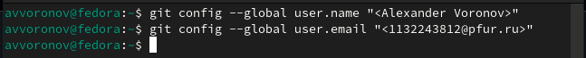{#fig:001 width=70%}

Настраиваю utf-8 в выходе сообщений git.(рис. -@fig:002)

{#fig:002 width=70%}

Задаю имя начальной ветки, которую буду называть master (рис. -@fig:003)

{#fig:003 width=70%}

Ввожу autocrlf и safecrlf (рис. -@fig:004)

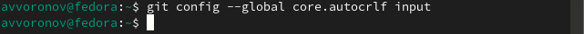{#fig:004 width=70%}

(рис. -@fig:005)

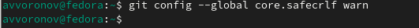{#fig:005 width=70%}

##Создание SSH-ключа

Для последующей идентификации пользователя на сервере репозиториев
генерирую пару ключей (приватный и открытый). (рис. -@fig:006)

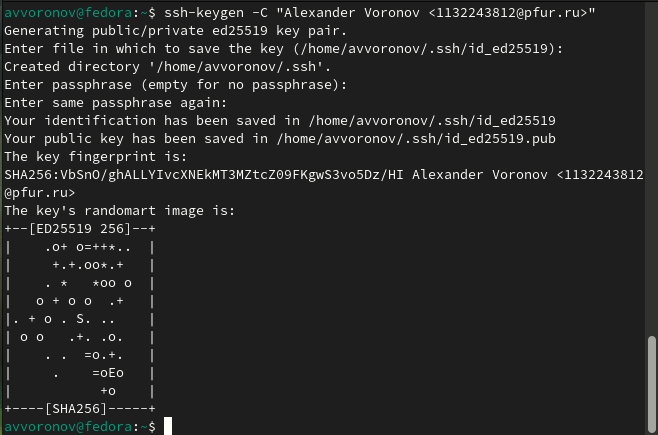{#fig:006 width=70%}

Чтобы скопировать из локальной консоли ключ в буфер обмена,
устанавливаю команду xclip. Затем воспользуюсь командой xclip (рис. -@fig:007)

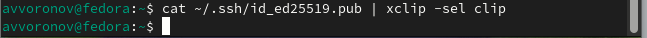{#fig:007 width=70%}

Вставляю ключ в появившееся на сайте поле, указываю его имя.(рис. -@fig:008)

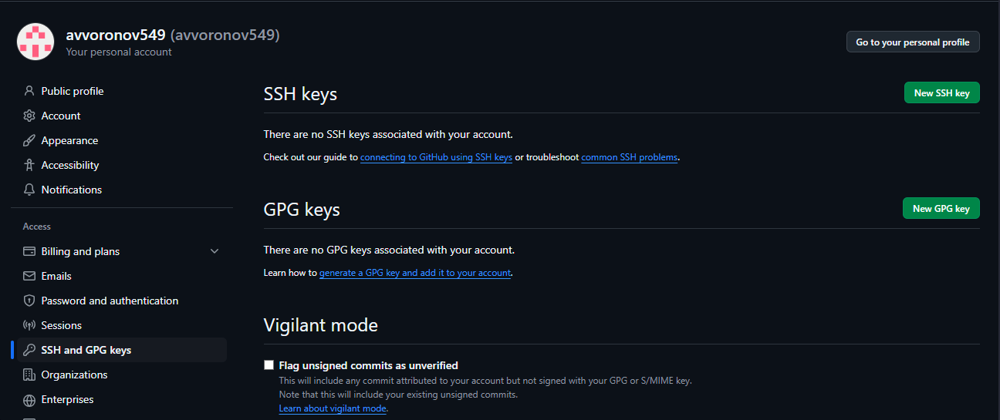{#fig:008 width=70%}

##Создание рабочего пространства на основе шаблона

Открываю терминал и создаю репозиторий для предмета «Архитектура
компьютеров». (рис. -@fig:009)

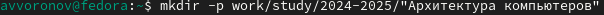{#fig:009 width=70%}

##Создание репозитория курса на основе шаблона

Захожу на страницу репозитория с шаблоном курса, выбираю его в качестве
своего нового. (рис. -@fig:010)

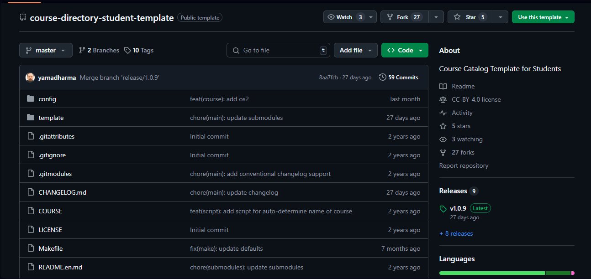{#fig:010 width=70%}

Затем создаю его, дав ему название. (рис. -@fig:011)

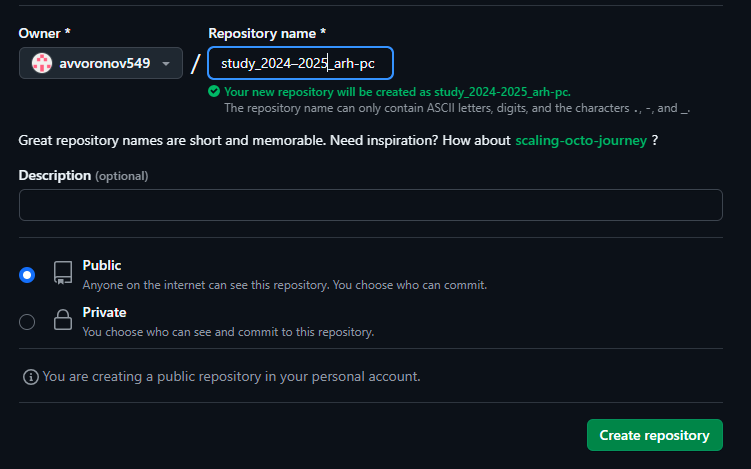{#fig:011 width=70%}

Открываю терминал и перехожу в каталог курса. (рис. -@fig:012)

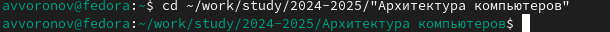{#fig:012 width=70%}

Клонирую созданный репозиторий (рис. -@fig:013)

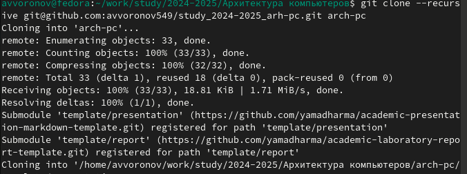{#fig:013 width=70%}

##Настройка каталога курса

Перехожу в каталог курса и удаляю лишний файлы (рис. -@fig:014)

![Переход в каталог курса] (image/017.PNG){#fig:014 width=70%}

(рис. -@fig:015)

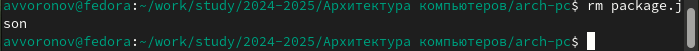{#fig:015 width=70%}

Создаю необходимые каталоги, отправляю файлы на сервер (рис. -@fig:016)

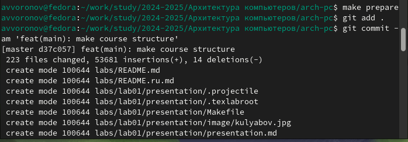{#fig:016 width=70%}

В репозитории проверяю результат выполненной работы. (рис. -@fig:017)

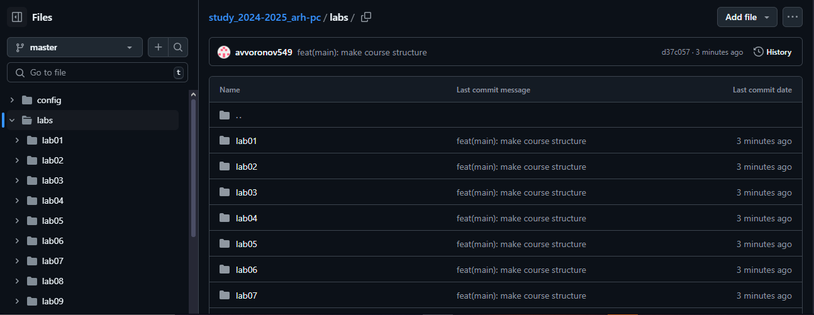{#fig:017 width=70%}

##Выполнение заданий для самостоятельной работы

Перехожу в директорию labs/lab02/report с помощью утилиты cd. Создаю в
каталоге файл для отчета по второй лабораторной работе с помощью утилиты
touch, после чего перехожу в директорию labs/lab01/report (рис. -@fig:018)

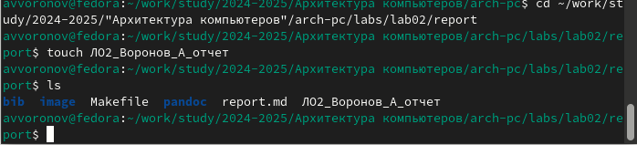{#fig:018 width=70%}

(рис. -@fig:019)

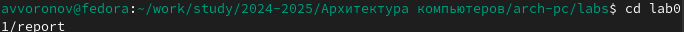{#fig:019 width=70%}

Проверяю местонахождение файла с отчетом по первой лабораторной
работой. Он должен быть в подкаталоге домашней директории «Загрузки», для
проверки использую команду ls. (рис. -@fig:020)

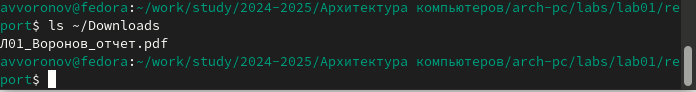{#fig:020 width=70%}

Копирую первую лабораторную с помощью утилиты cp и проверяю
правильность выполнения команды cp с помощью ls. (рис. -@fig:021)

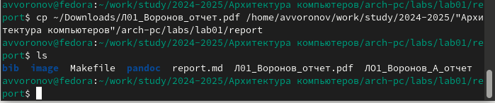{#fig:021 width=70%}

После чего добавляю файл в add Сохраняю изменения на сервере командой
git commit -m “…”, поясняя, что добавил файлы (рис. -@fig:022)

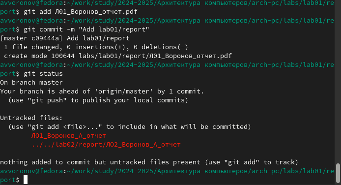{#fig:022 width=70%}

Аналогично я поступаю с отчётом по этой лабораторной работе, после чего
отправляю коммит на сервер.(рис. -@fig:023)

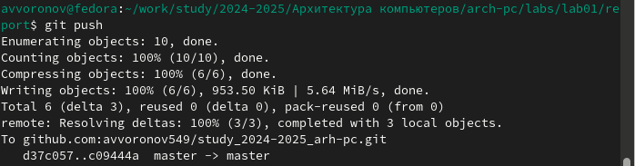{#fig:023 width=70%}

Вижу, что отчеты по лабораторным работам находятся в соответствующих
каталогах репозитория: отчет по первой - в lab01/report (рис. -@fig:024)

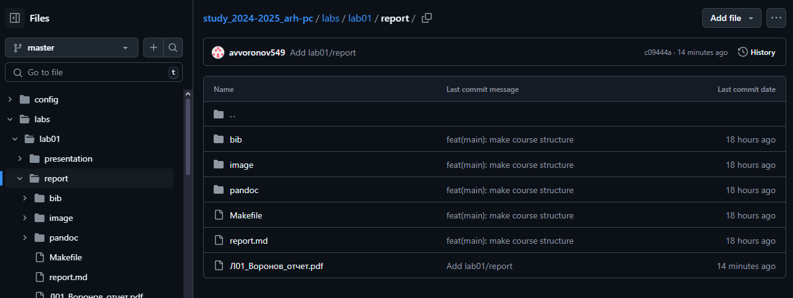{#fig:024 width=70%}

# Выводы

В заключение хочется отметить, что данная лабораторная работа позволила
мне научиться работать с системой Git. Я практиковал свои навыки в работе с
командной строкой, теперь уже связывая выполнимое с директориями GitHub.

# Список литературы

1. Архитектура ЭВМ
https://esystem.rudn.ru/pluginfile.php/2089082/mod_resource/content/0/Лаборато
рная%20работа%20№2.%20Система%20контроля%20версий%20Git.pdf
2. 30 команд Git, необходимых для освоения интерфейса командной строки Git /
Хабр https://habr.com/ru/companies/ruvds/articles/599929/
3. Система контроля версий: определение, функции, популярные решения
https://gb.ru/blog/sistema-kontrolya-versij/
4. Мой Github: https://github.com/avvoronov549/study_2024-2025_arh-pc

