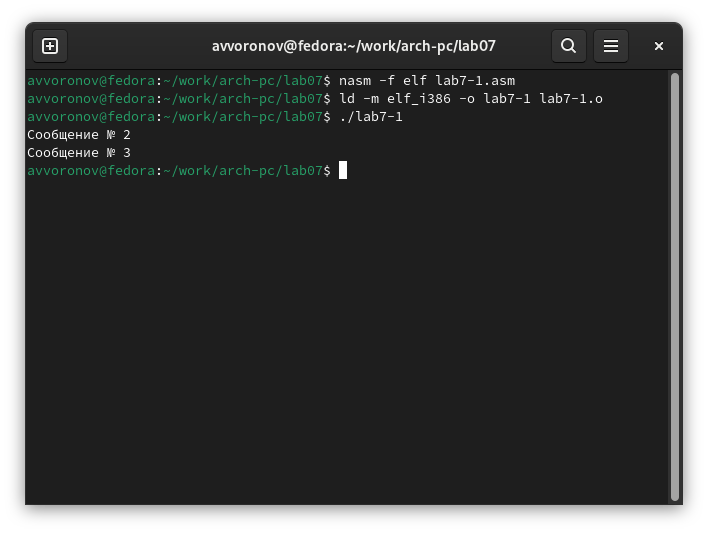
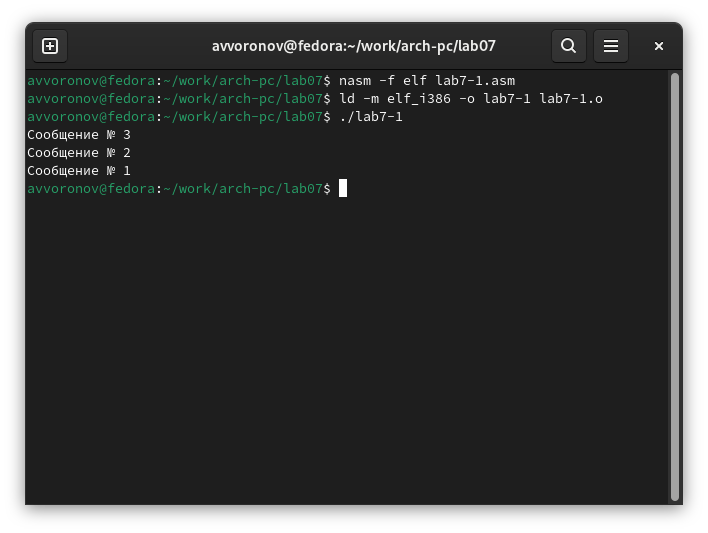

---
## Front matter
title: "Отчет по лабораторной работе №7"
subtitle: "Дисциплина: Архитектура компьютеров"
author: "Воронов Александр Валерьевич"

## Generic otions
lang: ru-RU
toc-title: "Содержание"

## Bibliography
bibliography: bib/cite.bib
csl: pandoc/csl/gost-r-7-0-5-2008-numeric.csl

## Pdf output format
toc: true # Table of contents
toc-depth: 2
lof: true # List of figures
lot: true # List of tables
fontsize: 12pt
linestretch: 1.5
papersize: a4
documentclass: scrreprt
## I18n polyglossia
polyglossia-lang:
  name: russian
  options:
	- spelling=modern
	- babelshorthands=true
polyglossia-otherlangs:
  name: english
## I18n babel
babel-lang: russian
babel-otherlangs: english
## Fonts
mainfont: IBM Plex Serif
romanfont: IBM Plex Serif
sansfont: IBM Plex Sans
monofont: IBM Plex Mono
mathfont: STIX Two Math
mainfontoptions: Ligatures=Common,Ligatures=TeX,Scale=0.94
romanfontoptions: Ligatures=Common,Ligatures=TeX,Scale=0.94
sansfontoptions: Ligatures=Common,Ligatures=TeX,Scale=MatchLowercase,Scale=0.94
monofontoptions: Scale=MatchLowercase,Scale=0.94,FakeStretch=0.9
mathfontoptions:
## Biblatex
biblatex: true
biblio-style: "gost-numeric"
biblatexoptions:
  - parentracker=true
  - backend=biber
  - hyperref=auto
  - language=auto
  - autolang=other*
  - citestyle=gost-numeric
## Pandoc-crossref LaTeX customization
figureTitle: "Рис."
tableTitle: "Таблица"
listingTitle: "Листинг"
lofTitle: "Список иллюстраций"
lotTitle: "Список таблиц"
lolTitle: "Листинги"
## Misc options
indent: true
header-includes:
  - \usepackage{indentfirst}
  - \usepackage{float} # keep figures where there are in the text
  - \floatplacement{figure}{H} # keep figures where there are in the text
---

# Цель работы

Изучение команд условного и безусловного переходов. Приобретение навыков написания
программ с использованием переходов. Знакомство с назначением и структурой файла
листинга.

# Задание

1. Реализация переходов в NASM
2. Изучение структуры файлов листинга
3. Самостоятельное написание программ по материалам лабораторной работы

# Теоретическое введение

Для реализации ветвлений в ассемблере используются так называемые команды передачи
управления или команды перехода. Можно выделить 2 типа переходов:
• условный переход – выполнение или не выполнение перехода в определенную точку
программы в зависимости от проверки условия.
• безусловный переход – выполнение передачи управления в определенную точку про-
граммы без каких-либо условий.

# Выполнение лабораторной работы

## Реализация переходов в NASM

Создаю каталог для программ лабораторной работы №7 (рис. -@fig:001).

{#fig:001 width=70%}

Копирую код из листинга в файл будущей программы. (рис. -@fig:002).

{#fig:002 width=70%}

При запуске программы я убедился в том, что неусловный переход действительно изменяет порядок выполнения инструкций (рис. -@fig:003).

{#fig:003 width=70%}

Изменяю программу таким образом, чтобы поменялся порядок выполнения функций (рис. -@fig:004).

{#fig:004 width=70%}

Запускаю программу и проверяю, что примененные изменения верны (рис. -@fig:005).

{#fig:005 width=70%}

Теперь изменяю текст программы так, чтобы все три сообщения вывелись в обратном порядке (рис. -@fig:006).

{#fig:006 width=70%}

Работа выполнена корректно, программа в нужном мне порядке выводит сообщения (рис. -@fig:007).

{#fig:007 width=70%}

Создаю новый рабочий файл и вставляю в него код из следующего листинга (рис. -@fig:008).

{#fig:008 width=70%}

Программа выводит значение переменной с максимальным значением, проверяю работу программы с разными входными данными (рис. -@fig:009).

{#fig:009 width=70%}

## Изучение структуры файла листинга

Создаю файл листинга с помощью флага -l команды nasm и открываю его с помощью текстового редактора mousepad (рис. -@fig:010).

{#fig:010 width=70%}

Объясняю три строчки из файла листинга: 23 00000106 E891FFFFFF call
atoi - Вызов подпрограммы перевода символа в число; 23 - номер строки,
00000106 - адрес, E891FFFFFF - машинный код; 41 0000014B 7F0C jg fin -
переход на label ‘fin’, если ‘max(A,C)>B’; 41 - номер строки, 0000014B - ад-
рес, 7F0C - машинный код; 50 0000016D E869FFFFFF call quit - Выход из
программы; 50 - номер строки; 0000016D - адрес; E869FFFFFF - машинный
код. 

Удаляю один операнд из случайной инструкции, чтобы проверить поведение файла листинга в дальнейшем (рис. -@fig:011).

{#fig:011 width=70%}

В новом файле листинга показывает ошибку, которая возникла при попытке трансляции файла. Никакие выходные файлы при этом помимо файла листинга не создаются. (рис. -@fig:012).

{#fig:012 width=70%}

## Задания для самостоятельной работы

Возвращаю операнд к функции в программе и изменяю ее так, чтобы она выводила переменную с наименьшим значением (рис. -@fig:013).

{#fig:013 width=70%}

Проверяю корректность написания первой программы (рис. -@fig:014).

{#fig:014 width=70%}

Пишу программу, которая будет вычислять значение заданной функции согласно моему варианту для введенных с клавиатурых переменных a и x (рис. -@fig:015).

{#fig:015 width=70%}

Транслирую и компоную файл, запускаю и проверяю работу программмы для различных значений a и x (рис. -@fig:016).

{#fig:016 width=70%}

# Выводы

При выполнении лабораторной работы я изучил команды условных и безусловных переходов, а также приобрел навыки написания программ с использованием перходов, познакомился
с назначением и структурой файлов листинга.

# Список литературы{.unnumbered}

1. [Курс на ТУИС](https://esystem.rudn.ru/course/view.php?id=112)
2. [Программирование на языке ассемблера NASM Столяров А. В.](https://esystem.rudn.ru/pluginfile.php/2088953/mod_resource/content/2/%D0%A1%D1%82%D0%BE%D0%BB%D1%8F%D1%80%D0%BE%D0%B2%20%D0%90.%20%D0%92.%20-%20%D0%9F%D1%80%D0%BE%D0%B3%D1%80%D0%B0%D0%BC%D0%BC%D0%B8%D1%80%D0%BE%D0%B2%D0%B0%D0%BD%D0%B8%D0%B5%20%D0%BD%D0%B0%20%D1%8F%D0%B7%D1%8B%D0%BA%D0%B5%20%D0%B0%D1%81%D1%81%D0%B5%D0%BC%D0%B1%D0%BB%D0%B5%D1%80%D0%B0%20NASM%20%D0%B4%D0%BB%D1%8F%20%D0%9E%D0%A1%20Unix.pdf)
